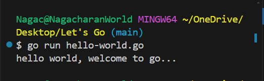

# Introduction to Golang and DevOps
[1. overview of go-lang](#overview-of-golang)

[2. Setting up the GoLang environment](#Setting-up-the-GoLang-environment)

[3. First Go program](#First-program-in-go)


## overview of golang
- Go is an opensource programming language developed by google on 2007

**features of go-lang**
<details><summary>Simplicity and Readability</summary>Go is designed to be simple and easy to understand. Its syntax is clean and concise, which makes it easy to read and write</details>
<details><summary>Concurrency Support</summary> One of the most notable features of go is its built-in support for concurrency. Go routines (lightweight threads) and channels (for communication between Go Routines) make concurrent programming more accessible and efficient. </details>
<details><summary>Fast Compilation</summary>Go compiles very quickly, which enhances the productivity of developers. This is partly due to its simplicity and the way it handles dependencies.</details>
<details><summary>Static Typing</summary>Go is statically typed, which means that types are checked at compile time. This can lead to more efficient code.</details>
<details><summary>Garbage Collection</summary>It has powerful garbage collector that helps manage memory automatically, reducing the risk of memory leaks and other memory-related errors </details>
<details><summary>Standard Library</summary>Go comes with a rich standard library that covers a wide range of functionalities from handling I/o to networking </details>
<details><summary>Cross-platform</summary> Go supports cross platform development, making it possible to build software that runs on various operating systems including windows, linux and macos </details>
<details><summary>Tools and Ecosystem</summary>Go has a growing ecosystem with a variety of tools for testing, debugging, and dependency management</details>

**usecases**

<details><summary>Web Development</summary>Go is often used for webservers, RESTFUl APIs and microservices due to its efficiency and scalability</details>
<details><summary>Cloud and network services</summary>Its performance and concurrency features make it suitable for cloud computing, networking services and distributed systems</details>
<details><summary>Devops and tooling</summary>Go is popular in the DevOps Community for building tools and utilities. thanks to its simplicity and ability to produce statically linked binaries that are easy to deploy e.x; docker, kubernetes, prometheus, terrfaform etcd, Grafana, Hugo, InfluxDB, CockroachDB etc</details>
<details><summary>Data Processing</summary>Go's performance characteristics make it suitable for data processing tasks that require concurrency and efficiency</details>

## Setting up the GoLang environment

**Installation**
- visit [go official installation page](https://go.dev/doc/install)
- `Go` installation is very easy and straight forward. We just have to head-over to the official go website or you can click on above link. Then select your Operating System (for me it's windows) and then download msi file. once download finished click on install and follow the installation prompt. That's it. You are now ready to `go`...

## First program in go

**Basic Syntax:**

let's run our first go-program.👇

``` go
# save file as hello-world.go

package main

import "fmt"

func main() {
	fmt.Println("hello world, welcome to go...")
}

```
- Run the file as `$ go run hello-world.go`



packages :

`package main`
- Every go file starts with a package declaration, which provides a way for code to be reused. The main package is the starting point of the GO program.
  
imports:
- This is where you include code from other packages. For ex: The `fmt` package, is commonly used for formatted I/O.
```go
import fmt
```
  
Functions:
 - Functions are declared with the `func` keyword. the main function is the entry point of a GO program.
``` go
   func main() {
      fmt.Package("hello world, welcome to go...")
   }
```

