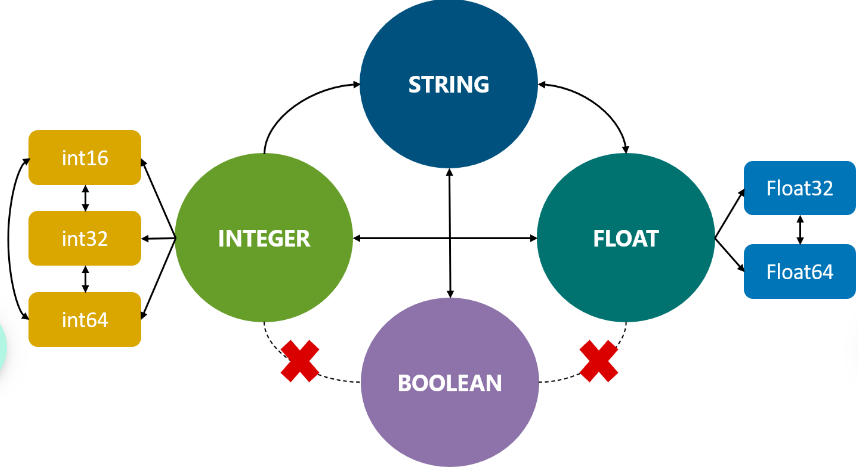
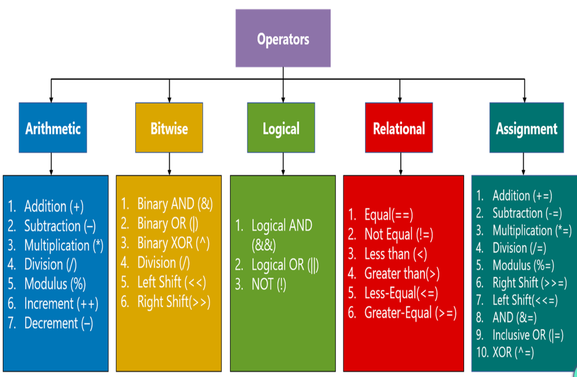
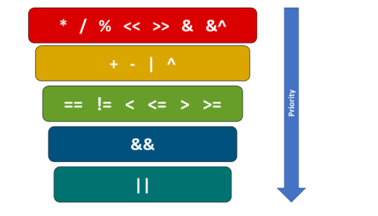

Introduction to GO

	Creation of GO : From 2009 to 2012, a new programming language was being developed by Google Engineers [Robert Griesemer, Rob Pike, and Ken Thompson] called as "go" or "golang"
	Agenda of GO: the agenda of go creation was to build in right, concise and limited features which served as the key reason for GO. They focussed on exploiting basic features and serve clarity rather than complex features which causes ambiguity
	Features of GO : In-Built concurrency, Garbage collection, OOPs simplified, Simplicity and efficiency, inference variable types, platform independent
	Application of GO: Go has applications in Web development, machine learning, command line tools and even server handling
	Real-time usage of GO:
		> Uber for microservices
		> Netflix for heavy data processing
		> Adobe for server handling
		> Yt, Apple and Docker also uses golang 
	Project aspects:
		> API/RPC services
		> CLI
		> Frameworks
		> Webservices
		> Automation/scripts
		> Agents/Daemons
		> Data processing
	
We already have bunch of other programming languages, why we need to learn go again instead of them ?

	1. Go is a compiled language which inherits positive traits from interpreted language.
	2. Go's approach for OOPS features in other languages is simplified (structs, interfaces, composition)
	3. Go has built-in constructs for concurrency (Concurrency establishes synchronization between dependent processes, shared data, and deadlocks. )
	
Getting started with GO :
	Installation and setup
		1. Go to go's official site and download
		2. go version --> To check go version
		3. go env GOROOT --> To check GOROOT path in your system
		
	additional data:
		gopls: It is offical Go language server developed by Go team, which is required when working with Go modules in vscode or other IDEs
		go-outline: It is library useful for extracting JSON representation of the declarations in Go source file
		go mod init: This command is used to initialize a new go.mod file in the currently active directory. This roots the new module in the current directory
		go mod tidy: This command ensures that go.mod file is up-to-date with all the packages and dependencies required by the source code to complete a successful build
		

First program in Go :
	```go
	package main
	import "fmt"
	func main(){
	fmt.Println("Hello, world")
	}
	```
	understanding written code:
	> packages are declared using package keyword followed by package name.
		`package <package name>`
	  package is a go keyword used for declaring packages. Every Go program commences with package declaration. Go organizes its code and reuses it by using packages.
	  In Go, main is a special package that contains the main() function and is also responsible for importing other standard library packages or third-party packages required in the program.
	  
	> import statements in Go are used to include different packages to be used in our program just like other programming languages. the "fmt" (shorthand for format) package is used for formatting input and outputs
		How to import ? There are two ways:
		1. By using import block() which will omit the redundancy of using import keyword for every package
		2. Traditional way as shown above
	> func main():
		Functions are just like in other programming languages are building blocks of code which provides reusability and increases maintainability of code
		
		In Go, main function inside the main package is the entry point. There may be some user-defined functions that might execute before main function but in general main function is the entry point when execution commences. Without main(() function in the main package, the Go compiler will not understand which program to execute.
		
	> fmt.Println() is the inbuilt function in go, bundled in fmt package. This function tells the compiler to print text on the screen.
		if we want to print formatted strings we can use another function inside fmt package that is fmt.Printf(). It contains symbols in the string which you want to print and then arguments after it will replace those values.
		
   How to run the Go program : go run <file name> 
   
 Till now we understand how to write basic hello world program and now let us proceed and understand how we can reuse our data by storing them into variables and reducing code redundancy.
 
 
variables in Go :
	- variables are memory locations used to store data. This data can be manipulated and rendered with use of identifiers. Identifiers are names given to these variables by the programmer.
	Variable Declaration:
		- variables declaration is broadly classified into two types. They are	1. function level 2. pacakge level
		
		```go
		// function level 
		
		var flag int = 24
		var count int
		var msg="Hello world"
		initializer:=100.0
		i, j, k := 1,2,3
		```
		
		```go
		// package level
		var flag int = 2300
		var count int
		var initializer = 26
		var (xy int = 25
		yz string = "var block"
		)
		```
	1. Declaring variables at function level :
	 There are 5 ways in which variables can be declared at functional level.
	 
	 ```go
	 func main(){
	 /*
	 1. Initializing at the time of declaration(standard way)
	 2. Initializing later
	 3. Initializing and declaring with type inference 
	 4. Shorthand initializing and Declaration
	 5. Using blank identifier 
	 */
	 var customerId int = 26 //1. at declaration time
	 var validity int
	 validity = 21 // 2. initializing later(useful while using loops)
	 var LoginMessage = "Hi user" //3. Initializing and Declaration with type inference
	 price := 100.0 // 4. Shorthand initialisation and Declaration 
	 i, j, k := 1, 2, 3 // 5. Initializing and declaration of multiple variables 
	 _=24 //5. Blank identifier
	 fmt.Println(validity, price, LoginMessage)
	 fmt.Println(i,j,k)
	 }
	 ```
	 var keyword is used to create variables in Go.
	 
	 shorthand declaration is useful when you are making extra initialization or creating a variable to catch value returned by a function
	 Since, Go is readable and concise programmming language. Go the programmer is not allowed to declare a variable and keep it unused. A compilation error will occur. To surpass that compilation error, we can use blank identifier that is _ to throwaway the variable and ignore showcasing errors for this variable.
	
	2. Declaring Variables at Package level 
		There are 4 ways in which variables can be declared at package level 
		
		```go
		/*
		1. standard way
		2. Initializing later
		3. type inference 
		4. var block
		*/
		var customerLoginId int = 245 // standard way
		var validity int // initializing later
		var years = 25 // type inference 
		func main() {
		fmt.Println(customerLoginId, validity, years)
		}
		```
		```go 
		var ( // var block
		customerName = "charan"
		customerAge = 45
		customerContact = "7979"
		)
		func main() {
		fmt.Println(customerName, customerAge)
		fmt.Println(customerContact)
		}
		
		```
		
		Note : variable declaration can be used at functional level too.
				variable declaration block is useful to club the variables associated with same function or business logic
				shorthand operator (:) cannot be used inside var block. Go will throw compilation error.
				
		```go
		func main(){
		var(
		planValidity int =24
		counter int 
		totalcontacts = 100
		)
		fmt.Println(planValidity)
		counter = 21
		i,j,k := 1,2,3
		fmt.Println(counter, totalContacts)
		fmt.Println(i,j,k)
		}
		```
		Redeclaration and shadowing:
		- In Go, we cannot redeclare variables in same scope. it means whether it is package level or function level you cannot declare any variable twice. It will throw and error "<variable-name> redeclared in this block"
		- variables in Go can be redeclared and reinitialized in different scope
		- when we reinitialize a variable in different scope, the innermost initialization takes highest priority. This concept is known as "shadowing"
		
		```go
		var customerLoginId string = "c1001"
		// variable declared at package level
		var validity int = 199
		func main() {
		fmt.Println(customerLoginId) // customerLoginId = c1001 
		var customerLoginId string = "c1002"
		// variable redeclared at block level
		validity = 100
		// reinitializing will shadow away previous value 
		fmt.Println(customerLoginId)
		var customerLoginId = 200
		// compilation error : customerLoginId redeclared in this block
		parse()
		fmt.Println(customerLoginId)
		}
		func parse() {
		customerLoginId = "c202"
		fmt.Println(customerLoginId)
		}
		
		```
		
		Variable Naming Conventions:
		
		- Name of variables in Go should commense with a letter, followed by arbitary number of letters, numeric values 
		- A variable should not commence with a numeric value 
		- A variable cannot contain spaces
		- variable names are case sensitive
		- variable names like i,j,k should be used for index type values 
		- variable names like aa, bb, tt should be used to name collections, arrays and slices
		- Interfaces should have a suffix of er in their names
		- variables name should be short but descriptive
		
		Visibility & scope :
		--------------------
		> Visibility and Scope of a variable in Go language can be classified into 3 levels:
		
		```go
		/*
		1.package level
		2. Global level
		3. Block level 
		*/
		package main
		import "fmt"
		var CustomerName string = "charan"
		// Global level --> Accessible by any package and function directly 
		var customerContact string  = "784729"
		//package level --> Accessible by all functions in this package directly 
		func main(){
		var customerLastName string = "Tait"
		// block level --> Accessible inside this function block only
		customerFullName := CustomerName+customerLastName
		fmt.Printf("%v \nContact No. %v)
		}
		```
		
		1. Package level:
		> Variables name, if begins with a lower-case letter then it is scoped to the package level 
		> all the functions within the same package can directly access these variables
		> No Function defined outside this package will be able to directly access these variables
		> These kinds of variables are known s unexported variables
		
		2. Global Variables :
		> variables name, if begins with an upper-cased letter then it is scopped to the global level 
		> All the functions and packages can access these variables 
		> these kinds of variables are known as exported variables 
		
		3. Block Level:
		> variables declared inside a function remains local to function 
		
		what if we required to store some values which cannot be altered? let's drive into Constants to understand 
		
Constants :

	- A constant is a name/identifier used to create fixed values. These values can be neither be altered by any function nor can be shadowed away by any reinitialization
	
	In Go, constants can be created using two approaches: 1. Using const keyword and 2. Constants declaration block 
	
	```go
	
	package main 
	import "fmt"
	const PI float64 = 3.1415926 // approach 1
	const PHI = 1.618035
	
	const ( //approach 2
	EULER's NUMBER = 2.718281
	AVAILABILITY = true 
	)
	func main(){
	fmt.Println("value of PI: ", PI)
	fmt.Println("value of Euler's Number (e): ", EULERS_NUMBER)
	}
	```
	
	1. Using const keyword: 
		> constants can be declared using const keyword, followed by the type of value to be stored
		> you can also follow type inference method as shown above (const PHI = 1.618033 ) to create constants without explicitly specifying the type 
		> Unlike variables you must initialize the value at the time of declaration
		
	2. Constants Declaration Block:
		> For greater code readability and quality Go provides us with an alternative approach of using multiple constants declaration block. You can omit using const keyword as prefix for every constant declaration 
		> const bocks are like var blocks
		
	Enumerated Constants:
	> Enumerated constants are set of named constants
	> an Enum Type is required to be declared using type keyword and the data type of the value stored in the constants of that enum type 
	> Go Uses a predefined declaration called iota to create related constants. IOTA initializes successive untyped integer constants
	> The default value of iota is zero
	
   ```go
   
   package main 
   import "fmt"
   type Directory int // enum Directory
   const (
   
   Contact1 Directory = iota // contact1 = 0
   Contact2 // Contact2 = 1
   Contact3 // Contact3 = 2
   Contact4 // Contact4 = 3
   )
   func main() {
   var NewContact Directory // Declaring a variable NewContact with type Directory
   NewContact = 2
   fmt.Println(NewContact == Contact3 )
   }
   ```
   - To throw away default value and start indexing your constants with index value =1 we can use below underscore approach :
   ```go
   package main 
   import "fmt"
   type Directory int // enum Directory
   const (
   _ Directory = iota // throws away first iota value i.e; 0
   Contact1
   Contact2
   Contact3
   Contact4
   )
   func main(){
   var NewContact Directory // Declaring a variable NewContact with type Directory 
   NewContact = 2
   fmt.Println(NewContact==Contact2)
   }
   ```
 Best Practices :
 1. use small names for unexported variables
 2. use long and appropriate names for exported variables 
 3. use capital letters for acronyms in order to increase their readability
 4. Never leave any variable unused as compilation error will be thrown by Go 
 5. Constants follow the same naming conventions as of variables
 6. Constants names must be written in Uppercase letters for ease of differentiation and readability
 
 
Data Types:


	The size and type of data stored in a variable is defined by its DataTypes (also known as primitives)
	
	DataTypes are broadly classified into 3 types. They are 1. Basic Types (numeric, booleans, text) 2. Aggregate types(structs, Arrays) and 3. Reference Types (pointers, functions, Maps, slices)
	
	Boolean Data Type:
		> Boolean data type has two states: TRUE or FALSE. These two values represent the two truth values of logical and boolean algebra. 
		> Default value for Boolean datatype is FALSE
		> In Go, bool is the keyword to declare a Boolean type variable 
		> Boolean values don't support implicit or explicit type conversion
		
		How Boolean type of variables are creatd in Go ?
			
		```GO
		package main
		import "fmt"
		func main() {
		isPasswordValid := true // the default value of isPasswordValid is false 
		var isAccountValid bool 
		fmt.Println("isPasswordValid:", isPasswordValid, "isAccountValid:", isAccountValid)
		```
	Arithmetic types in go falls under numeric data types. They can be classified as integers, Floating point numbers and complex numbers. 
	
	1.Integers:
		- In Go, we have signed and unsigned integers to hold negative and postive values respectively. There are different ranges integer type variables can hold. For Ex: int16, int32, uint16 and so on
		- Default value for integers is 0
		- In Go, int is the keyword used to create a variable of integer type
		- Type Conversion for int type of variables is possible 
    
	```GO
	package main 
	import "fmt"
	func main() {
	var planPrice uint8 = 225 // using 8-bit unsigned int 
	fmt.Println(planPrice)
	var validityDays int16 = 32767 // using 16-bit signed int 
	fmt.Println(validityDays)
	}
	```
	
	2. Floating Point:
		- In Go, float data type stores decimal values in single or double precision format 
		- Default value for float is 0. The default type for floating point is float64
		- In Go, float32 or float64 are the keywords used to create a variable of float type.
		- Float allows IEEE 754 standards and type conversion is possible with Float
		
	```GO
	package main
	import "fmt"
	func main() {
	var averageSales float32=10
	quarterlyAverage:=20.1 // type of quarterly is float64
	fmt.Printf("averageSales type %T, quarterlyAverage type %T", averageSales, quarterlyAverage)
	}
	```
	
	Complex Numbers:
	
	- The complex data type is store numbers of form a+ib; where a is the real part and i is indeterminate or imaginary unit
	- Default value for complex numbers is 0+0i
	- In Go, there are two types of complex numbers: complex64 or complex128. The Go's parser understands "i" as the imaginary part in complex numbers.
	- There are three built in functions for complex numbers: real(), imag() and complex()
	- real() will return real part of the complex number and imag() returns the imaginary part of the complex number 
	- complex() takes in real, imaginary part as input and returns the complex number formed.
	
	|Type|Size|Range|
	|---|---|---|
	|complex64|64bits|composed of float32 real with an imaginary part |
	|complex128|128bits|Composed of float64 real with an imaginary part|
	
	```GO
	package main 
	import "fmt"
	func main(){
	var num1 complex128 = 2 + 3i // creating complex type test variable 
	var num2 complex64 = complex(2, 10) // creating complex type variable using inbuilt function 
	fmt.Println(num1)
	fmt.Println(num2)
	fmt.Printf("%V,%T \n", real(num1), real(num1)) // using inbuilt function to render real part
	fmt.Printf("%V, %T \n", imag(num1), imag(num1)) // using inbuilt function to render imaginary part
	}
	```
	
	Runes:
	- Rune type is same as int32 which constitutes unicode points
	- Runes can be created using enclosing one or more characters in single quotes like 'g','\t' etc in between single quotes except for a new line and an unescaped single quote.
	
	```GO
	package main 
	import "fmt"
	func main() {
	arr1:='A'
	arr:='♠️'
	fmt.Printf("Character %c, Unicode %U",arr1,arr1)
	fmt.Printf("\nCharacter %c, Unicode %U", arr,arr)
	}
	```
	
	strings:
	- strings are text types used to store values like customerName, customerContact, customerAddress, etc
	- In Go, strings are defined as a sequence of characters. These characters are of variable width and each character is represented by one or more bytes
	- Character representation in strings uses UTF-8 Encoding (variable-width encoding technique)
	- strings are immutable. This implies that strings value can be replaced by whole new strings, but individual string values cannot be altered.
	- Although, strings can be concatenated
	- Default value of string is nothing but blank string, NOT a null string.
	
	```GO
	func main() {
	loginPass := "Welcome User! \n Login Successful"
	// creating using shorthand Declaration
	var age string 
	// creating string using var keyword
	age = "27 years"
	fmt.Println("String 1: ", loginPass )
	loginPass[2] = "No"
	// It will throw a compilation error: cannot assign to LoginPass[2]
	fmt.Println(String 2: ", age)
	}
	```
	
	What are different ways in which strings can be declared? what are string literals?🤔
	
	As we aware, strings in Go are UTF-8 encoded, there are two alternatives to create string literals:
	
	1.Interpreted Literals/Double quotes literals
	- Double quotes are used to create interpreted literals
	- This type of literals recognizes esc character, but they don't support spanning multiple lines
	2. Raw literals/Backtick literals
	- Raw literals are created using pair of backticks. These type of literals are created for spanning multiple lines
	- They don't recognize esc charaacters as was the case with interpreted literals
	
	```GO
	func main(){
	loginPass := "Welcome user! \n Login Successful"
	// creating interpreted string literals
	var age string
	age = `27 years \n`
	// \n won't be recognized by raw string literals
	fmt.Println("String 1:", loginPass)
	fmt.Println("String 2:", age 
	}
	```
	calculating length of strings:
	- Length of a variable declared as string can be calculated using len() inbuilt Function
	- An alternative approach Go offers is using RuneCountInString() this is a function defined in UTF8 package and it will return total number of runes present in the string
	
	```GO
	import "unicode/utf8"
	func main(){
	loginPass := "Welcome User! \n Login Successful"
	var age string 
	age = "27 years"
	fmt.Println("String 1 Length is : ", len(loginPass)) // length calculated using len()
	fmt.Println("String 2 Length is: ", utf8.RuneCountInString(age)) // using RuneCountString
	}
	```
	
	Type Conversion:
	- Type conversion is a technique by which values of one primitive type can be converted into another type of primitive. There are two types of type conversions:
	1. Implicit Type conversion:
	- Values stored in a variable of smaller data type can be promoted to larger data type automatically without mentioning explicitly. For ex: short type variable can be stored in int type variable
	
	2. Explicit Type Conversion:
	- Value stored in larger datatype if required to be accomdated in a small datatype, programmer is required to mention that explicitly
	
	- Go, supports explicit type conversion only. 
	
	
	
	```GO
	func main(){
	var i int = 10
	fmt.Printf("Variable i: Value: %v, Type: %T \n", i , i)
	var f32 float32 = 10.564
	fmt.Printf("Variable f32: Value: %v, Type: %T \n", f32, f32)
	i16 := int16(i) // Converting int8-->int16
	fmt.Printf("Variable i16: Value: %v, Type: %T \n", i16, i16)
	i32 := int32(i) // converting int16 --> int32
	fmt.Printf("Variable i32: Value: %v, Type: %T \n", i32, i32)
	i64 := int64(i) // converting int32-->int64
	fmt.Printf("Variable i64: Value: %v, Type: %T \n", i64, i64)
	f64 := float64(f32) //converting float32 --->float64
	fmt.Printf("Variable f64: Value: %v, Type: %T \n", f64, f64)
	f32 = float32(f64) //Converting float64--->float32
	fmt.Printf("Variable f32: Value: %v, Type: %T \n", f32, f32)
	i32 = int32(f32) //Converting float32--->int32
	fmt.Printf("Variable i32: Value: %v, Type: %T \n", i32, i32)
	f64 = float64(i32) //Converting int32--->float64
	fmt.Printf("Variable f64: Value: %v, Type: %T \n", f64, f64)
	
	//Converting int64 integer to string using FormatInt() func (from "strconv" package)
	var strVar string = strconv.FormatInt(i64, 10) //Here, "10" denotes Base to which the number would be converted
	fmt.Printf("Variable strVar: Value: %v, Type: %T \n", strVar, strVar)
	
	//Converting string value stored in strVar to int using Atoi() func (from "strconv" package)
	strVar2 := "100"
	intVar, _ := strconv.Atoi(strVar2) 
	fmt.Printf("Variable intVar: Value: %v, Type: %T \n", intVar, intVar)
	floatVar, _ := strconv.ParseFloat(strVar, 8) //Converting string to float using ParseFloat func.
	fmt.Printf("Variable floatVar: Value: %v, Type: %T \n", floatVar, floatVar)
}
	
	
	```
	
	Note: To convert integer, float or boolean value to string type representations and vice versa we are using the strconv package and its functions (Atoi(), itoa(), ParseFloat(), Formatint() etc)
	
	Did you ever think how these variables interact each other ? The answer is operators
	
Operators:
	- Operators are symbols that perform a certain process and yields a result.
	
	

	
	Arithmetic Operators:
	
|Operator|Operation|Description|
|---|---|---|
|+|Addition| Add Operands|
|-|Subtraction|Subtracts the operand |
|*|Multiplication|Multiplies Operands |
|/|Division|Divides the operand |
|%|Modulus|Returns the remainder after division |

	Relational Operations:
|Operators|Operation|Description |
|---|---|---|
|==|Equal|Returns true if both operands are equal |
|!=|not equal|Returns true if both the operands are not equal |
|<|less|Returns true if the right-hand side operand is larger than left operand // not 0 or 1 |
|<=|less or equal|Returns true if the right-hand side operand is larger or equal to the left operand |
|>|greater|Returns true if the left-hand side operand is larger than the right-hand side operand |
|>=|greater or equal|Returns true if the left operand's value is larger or equal to the right operand |

	Logical Operators:
|Operator|Operation|Description|
|---|---|---|
|&&|Logical AND|Returns true if both the operands are true|
| || | Logical OR|Returns true if one of the operands is true |
|!|NOT|Changes the state of the operand. If an expression is true, it returns false |

	Bitwise Operators:
|Operators|Operation|Description |
|---|---|---|
|&|Binary AND|A bit added to the outcome if it is available in both operands |
|||Binary OR|A bit added to the outcome if it is available in any one operand |
|^|Binary XOR|A bit added to the outcome if the bit is available in only one operand |
|<<|Left Shift|The bits of the operand given at the left side will be moved to the left by the times mentioned in the right side |
|>> |Right Shift|The bits of the operand given at the left side will be moved to the right by the times mentioned at the right side |
	Assignment operators:
	
|Operators|Operation|Description |
|---|---|---|
|+=|Addition Assignment|Both operands values will be added, and the outcome will be assigned to the left operand|
|-=|subtraction assignment|Subtracts the operand and outcome will be assigned to left operand |
|*=|Multiplication assignment|Multiplies both operands and assign the outcome to left operand |
|/=|Division assignment|Divides left operand by right operand and assign the outcome to the left operand |
|%=|Modulus assignment|Modulus using two operand's value and assign the outcome to the left operand |
|>>=|Right shift assignment|The bits of the operand given at left side will be moved to the right by the times mentioned at the right side and assign to the left operand |
|<<==|Left shift assignment|the bits of the operand given at left side will be moved to left by the times mentioned at the right side and assign to the left operand|
|&=|AND Assignment|if same bits are available in both operand it will be added to the outcome and assigned to left operand|
||=|inclusive OR assignment|if a bit exists in either of operands, then assign it to left operand|
|^=|XOR assignment|A bit added to the outcome if the bit is avaiable in only one operand and assign it to left operand|

```GO
func mai(){
customerBill := 340.0
fixedCharges := 20.0
oneDaycharge := 10.0
discount := 20.0

totalCustomerBill := customerBill + fixedCharges //Addition
fmt.Printf("Total Bill for you is =Rs. %v", totalCustomerBill)
fixedCharges := totalCustomerBill - customerBill //subtraction
fmt.Printf("\nFixed Charges applied to your plan are RS. %v", FixedCharges)
oneMonthBill := oneDaycharge * 30 //Multiplication
fmt.Printf("\nYour one month billl is =RS %v', oneMonthBill
billAfterDiscount := oneMonthBill - (oneMonthBill*discount)/100 //division
fmt.Prinf("\nBill after discount = RS. %v", billAfterDiscount)

moduloexample := 40 % 3 //Modulus 
fmt.Printf("\nResult of 40 %% 3 = %v", moduloexample)
}

```
	Some important points about results of Arithmetic operator operations:
	
	1.**Result_Type1 = Type1_variable1 <operator> Type1_variable2:**
	- if two operands of same type are involved in an arithmetic operation the type of result will be same as of the two Operators
	
	2. **Result_Type1 = Type1_variable1 <operator> Untyped_variable2**
	- if two operands are involved in an arithmetic operation in which one variable is typed and other is untyped; Both the result and the untyped variable will take type of the typed operand (Here: Type of variable1)
	
	3. **Result_Type = untyped_variable1 <operator> Untyped_variable2**
	- Result's type will remain untyped if two untyped operands are involved in arithmetic operation. Although, result will take one of the default values of the two untyped operands.
	
```GO
package main
import "fmt"
func main(){
//CASE 1: Result_Type1 = Type1_variable1 <operator> Type1_variable2:

var count int =25
var flag int = 32
result01 := count * flag
fmt.Printf("%T\n",result01)

//CASE2: Result_Type1 = Type1_variable1 <operator> Untyped_variable2

var count2 float64 = 12.1
flag2:= 31.3
result02 := flag2-count2
fmt.Printf("%T\n", result02)

//CASE3: Result_Type = Untyped_variable2 <operator> Untyped_variable2

count3:=3i
const flag3 = 'A'
result03 := count3*flag3
fmt.Printf("%T", result03)
}
```
	- operator precedence dictates order in which operators will be computed. Operator precedence is important to learn as without well-defined precedence, the expressions become ambiguous and computational results will differ.
	
	
	
```GO
// tryout string to int 

package main
import (
   "fmt"
   "strconv"
)
func main() {
   id := 123
   fmt.Printf("'id' is of type '%T'\n",id)
   var uid uint32 = 213
   fmt.Printf("'uid' is of type '%T'\n",uid)
   //uncomment the below code and observe the output
   //var uid uint32 = -21
   name := "12"
   fmt.Printf("'name' is of type '%T'\n",name)
   salary := 15000.68
   fmt.Printf("'salary' is of type '%T'\n",salary)
   val := false
   fmt.Printf("'val' is of type '%T'\n",val)
   var door string = "121"
   doorNo,_:=strconv.Atoi(door) //Atoi returns two values, we ignore the 2nd value by using '_'
   fmt.Printf("'door' is of type '%T' & 'doorNo' is of Type '%T'\n",door,doorNo)
   idFloat := float32(id) //type casting data type of id from 'int' to 'float32'
   fmt.Printf("'idFloat' is of type '%T'\n",idFloat)
}
```

```GO
//write a code to deduct 5.6 % of tax on the total intern salary

package main
 
import "fmt"
 
func main() {
baseSalary := 15000+500.34 //baseSalary will take the data type of the latter, if untyped variable is included in the operation
var internSal float32 = 1000
totalSalary := baseSalary+float64(internSal)
var bonus = 10
var totalInternSal = (baseSalary*float64(bonus)/100)+totalSalary
fmt.Println("Total intern salary:",totalInternSal)
}
```

operators -Ex:1 :

```GO
/*
Problem Statement
Joy went shopping for groceries, the shopping mart he went to has a discount rate of 5%, since he is a regular customer, he gets 2 times of the discount rate on the total cost. The discount rate is as follows:

new	1*5%
regular	2*5%
special	3*5%
Discount Rate
Note: Use enumerated constants to get total discount rate.

Write a code to calculate total cost after discount.

Input	Expected Output
Name=Joy

Id=123

Cost=2500

Discount=5%*regular

Joy123: 2250

 ​​​​​

Sample Data

/*
package main

import (
	"bufio"
	"fmt"
	"os"
	"strconv"
)

func main() {
	name, id, cost, customer_type := input()

	//Enter your code here
	

}

// do not modify the code below
func input() (string, int, int, string) {
	scanner := bufio.NewScanner(os.Stdin)
	// Read the line
	scanner.Scan()
	line1 := scanner.Text()

	// Split the line by comma
	data := strings.Split(line1, ",")
	// Get the values
	name := data[0]
	// Convert the string to int
	id, err := strconv.Atoi(data[1])
	if err != nil {
		fmt.Println(err)
	}
	// Convert the string to int
	cost, err := strconv.Atoi(data[2])
	if err != nil {
		fmt.Println(err)
	}
	// Get the value
	customer_type := data[3]

	// Return the values
	return name, id, cost, customer_type
}
```

Conditional Statements:

	"How do we control the flow of our program ?"

	- Control flow can be achieved using conditional(decision/iteration) statements and looping constructs

	- We can implement control flow in Go using:
	
	> if-else or if-else if-else (Decision)
	> switch-case (Selection)
	> for (Iteration)
	
	if-else Statement:
	
```GO

/*
if condition {
// statements to be executed in if block
}
*/
var plan string = "Prepaid"
if plan =="prepaid" {
fmt.Println("Existing plan is prepaid")
}
```

```GO
/*
if condition {
// statments to be executed in if block
}else {
//statments to be executed in else block
}
*/
var plan string = "Postpaid"
if plan=="Prepaid" {
fmt.Println("Existing plan is prepaid")
}else {
fmt.Println("Existing Plan is Postpaid")
}
}
```

```GO
/*
if condition1 {
//statements to be executed in if block
}else if condition2 {
//statments to be executed in else if block
}else {
//statements to be executed in else block
}
*/
var plan string = "Undefined"
if plan=="Prepaid" {
fmt.Println("Existing plan is prepaid")
}else if plan=="Postpaid" {
fmt.Println("Existing plan is postpaid")
}else {
fmt.Println("Existing Plan is undefined")
}
}
```

```GO
// alternative variant of if-block 
/*
if statement; condition {
//statement and condition separated by semicolon
//statements to be executed in if block
}
*/
if plan := "Postpaid"; plan=="Prepaid" {
fmt.Println("Existing plan is prepaid")
}else {
fmt.Println("Existing plan is Postpaid")
}
}
```

```GO
var plan string = "Postpaid"
if plan2 := "Undefined"; plan=="Prepaid" {
fmt.Println("Existing plan is prepaid")
}else if plan = "Postpaid"; plan2=="Postpaid" {
// statement for else if is mentioned before the condition
fmt.Println("Existing plan is postpaid")
}else {
fmt.Println("Existing plan is undefined")
}
}

```

```GO
//Error-thrown
//wrongway
if plan := "Postpaid"; plan=="Prepaid" {
fmt.Println("Existing plan is prepaid")
}
else {
fmt.Println("Existing plan is Postpaid")
}

//correct way
if plan := "Postpaid"; plan=="Prepaid" {
fmt.Println("Existing Plan is Prepaid")
};
else {
fmt.Println("Existing Plan is Postpaid")
};

```

switch-case in Go:

a. Duplicate cases or multiple cases with similar conditions are not allowed. The compiler will throw error for the same

```GO
var plan string = "Pre"
switch plan {
case "Prepaid":
	fmt.Println("Plan: Prepaid")
	fmt.Println("Please purchase the required service before availing it")
	case "Prepaid":
		fmt.Println("Plan: Postpaid")
		fmt.Println("Please subscribe the required service and pay at the end of the month")
		default:
			fmt.Println("Plan: Undefined")
			}
```
b. An individual case can contain multiple values for comparision. For ex:

```GO
var plan string = "Prepaid"
switch plan {
case "Prepaid", "Postpaid":
	fmt.Println("Plan: Prepaid")
	fmt.Println("Plan: Postpaid")
default:
	fmt.Println("Plan: Undefined")
}
```

c. Default case can come in between other cases. There is no strict rule to mention the default case at the end, and the compiler will not throw any error for the same. Ex:

```GO
var plan string = "Prepaid"
switch plan {
case "Prepaid":
	fmt.Println("Plan: Prepaid")
default:
	fmt.Println("Plan: Undefined")
case "Postpaid":
	fmt.Println("Plan: Postpaid")
	}
```

d. Alternative syntax we discussed for if-else statements can also be implemented in swith-case as well-defined

```GO
/*
switch statement; expression{
case conditionA:
//statements to be executed for condition A 
case conditionB:
//statements to be executed for condition A 
// simmilarly other cases to be mentioned here 
default:
	//statements to be executed for default case (when cases mentioned above are not met)
	}
*/
switch plan:= "Prepaid"; plan {
case "Prepaid":
	fmt.Println("Plan: Prepaid")
case "Postpaid":
	fmt.Println("Plan: Postpaid")
default:
	fmt.Println("Plan: undefined")
}

``` 

Iteration using for loop:

```GO
// break statements in for loop
for count := 1; count <= 10; count++ {
if count > 5 {
break
}
fmt.Println("This is loop iteration No. %d \n", count)
}
```

```GO
for count := 1; count <= 10; count++ {
if count%2 == 0 {
continue
}
fmt.Println("this is iteration No. %d. Hence, iteration No. %d is skipped \n", count, count+1)
}
```
```GO
/*
initialize the variable balance within if statement along with the condition. Execute the code to observe the changes in the output. Change the value of amount to see the changes in the output
*/
package main

import "fmt"

func main() {

// variable balance declared and initialized
    balance := 600
    fmt.Println("Balance before transaction: ", balance)

// variable amount declared and initialized
    amount := 500
    fmt.Println("Amount to withdraw: ", amount)

// if-else block 
    if amount <= 0 {
        fmt.Println("Withdrawal has failed as the amount is negative")
    } else if amount > balance {
        fmt.Println("Withdrawal has failed as the balance is low")
    } else {
        balance -= amount
        fmt.Println("Withdrawal has succeeded")
    }

    fmt.Println("Balance after transaction: ", balance)
}
```

```GO
/*
declare and initialize the variable discount within switch statement along with the condition. Execute the code to observe the changes in the output. Change the value of custType to see the changes in the output.

Also, try to create duplicate cases and change the order in which they are declared. Execute the code and observe the changes in the output.
*/
package main

import "fmt"

func main() {

//variables discount and custType declared
            var discount float32
	var custType string = "Premium" 

//switch case statement 
//Try declaring variable discount with switch case condition
	switch custType {

	case "Regular":
		discount = 5
		fmt.Println("Regular customers are eligible for 5% discount")

	case "Premium"
		discount = 10
		fmt.Println("Premium customers are eligible for 5% discount")

	default: 
		discount = 0
		fmt.Println("Guest customers are not eligible for discount")
	}

       /* switch number:=5+3; number {		
 	case 1, 5, 10:
fmt.Println("The number displayed is: ",number)
case 2, 3, 8:
fmt.Println("The number displayed is: ",number)
default: 
fmt.Println("The number displayed is: ",number)
}       */
}

```

```GO
//for loop understanding
/*
changing the values of balance, rateOfInterest, interest and deposit. execute the code and observe the changes in the output.

 

Moreover, try declaring and initializing the above mentioned variables inside the for loop, execute the code and observe the changes in the output.
*/
package main

import "fmt"

func main() {

// variables declared using shorthand declaration method
    balance := 6000.00
    rateOfInterest := 0.10
    interest := 0.00
    deposit := 600.00

// initializing the for loop
// try declaring the above mentioned variables inside for loop and observe the changes
    for i := 1; i <= 12; i++ {
        balance += deposit
        balance -= deposit
        interest = balance * rateOfInterest
        balance += interest
        fmt.Println("The interest for the month ", i, " is ", interest)
    }
    fmt.Println("The balance at the end of the year is ", balance)
}
```


```GO
/*
mplement a program to find and display the maximum number out of the given three numbers.

Consider the following sample inputs and outputs:
|sample input | Sample output|
|---|---|
|num1=21, num2=24, num3=32|32|
|num1=12,num2=21,num3=14|21|

*/
package main

import (
	"bufio"
	"fmt"
	"os"
	"strconv"
)

func main() {
	num1, num2, num3 := input()
	//Implement your code here
	
}

// do not modify the code below
func input() (int, int, int) {
	scanner := bufio.NewScanner(os.Stdin)
	// Read the line
	scanner.Scan()
	line1 := scanner.Text()

	// Split the line by comma
	data := strings.Split(line1, ",")

	// Convert the string to int
	num1, err := strconv.Atoi(data[0])
	if err != nil {
		fmt.Println(err)
	}

	// Convert the string to int
	num2, err := strconv.Atoi(data[1])
	if err != nil {
		fmt.Println(err)
	}

	// Convert the string to int
	num3, err := strconv.Atoi(data[2])
	if err != nil {
		fmt.Println(err)
	}

	// Return the values
	return num1, num2, num3
}

```

```GO
/*
Implement a program to check whether a given number is an Armstrong number.

An Armstrong number is an n-digit number that is equal to the sum of the nth powers of its individual digits.

E.g.: 371 is an Armstrong number as 33 + 73 + 13=371

        1634 is an Armstrong number as 14 + 64 + 34+ 44=1634
|Sample input|sample output|
|---|---|
|407|407 is an Armstrong number|
|8207|8207 is not an Armstrong number|
*/
package main

import (
	"bufio"
	"fmt"
	"os"
	"strconv"
)

func main() {
	num := input()
	//Implement your code here
	
	
}

// do not modify the code below
func input() int {
	scanner := bufio.NewScanner(os.Stdin)
	// Read the line
	scanner.Scan()
	line1 := scanner.Text()

	// Convert the string to int
	num, err := strconv.Atoi(line1)
	if err != nil {
		fmt.Println(err)
	}

	// Return the values
	return num
}

```
- By skipping variable initialization and updation while declaring the for loop, we can logically implement a While loop using the For loop.
Go also allows multiple variable declaration, condition involving those variables and multiple variable updation during declaration of the for loop


Pointers:

	Pointer is a special variable that stores the memory address of another variable
	
	`var pointer_name *Data_Type` --> pointer Declaration
	`var ptrGreeting *string`
	
	`var ptrGreeting *string = &greeting` -->initialization of Pointer
	
	& operator is termed as address operator which is used to return the address of a variable.Here we are returning the address of a variable greeting by writing &greeting and then we are assigning this address to ptrGreeting
	
	* is used to declare pointer and & is used to access the address.
	
		Different ways of creating Pointers:
		
		1. Pointer using Data type:
```GO
	package main
import (
	"fmt"
)
func main() {
	//declaring and initializing variable greeting
	var greeting string = "Hello World"
	//declaring and initializing string pointer, ptrGreeting
	var ptrGreeting *string = &greeting
	fmt.Println("value of greeting", greeting)
	fmt.Println("address of greeting", &greeting)
	fmt.Println("value of ptrGreeting", ptrGreeting)
}

```
		
		2. Shorthand declaration
```GO
package main
import (
    "fmt"
)
func main() {
    //declaring and initializing variable greeting
    greeting:= 20
    //declaring and initialization pointer, ptrGreeting
    ptrGreeting := &greeting
    fmt.Println("value of greeting", greeting)
    fmt.Println("address of greeting", &greeting)
    fmt.Println("value of ptrGreeting", ptrGreeting)
}

```
		
		3. Using Built-in New function:

```GO
package main
import (
    "fmt"
)
func main() {
    //declaring and initializing variable greeting
    var greeting string = "Hello World"
    //declaring string pointer, ptrGreeting
    ptrGreeting := new(string)
    //initialization of pointer
    ptrGreeting = &greeting
    fmt.Println("value of greeting", greeting)
    fmt.Println("address of greeting", &greeting)
    fmt.Println("value of ptrGreeting", ptrGreeting)
}

/*
output:

value of greeting Hello World
address of greeting 0xc000088230
value of ptrGreeting 0xc000088230

*/

/*
How does the above code is working ?
Whenever we create a pointer using the new function, it creates a default or zero valued pointer or nil pointer with the data type as specified as parameter to this new function. Further we can use that pointer and assign it the address of the variable to which we want it to point to.
/*
```
	- Go does not support Arithmetic pointers. But it allows us to compare two pointers having same data type for equality using == Operator
	
	```GO
	package main
	import "fmt"
	func main() {
	var num = 90
	var ptr1 = &num
	var ptr2 = &num
	if ptr1 == ptr2 {
	fmt.Println("Pointer ptr1 and ptr2 points to the same variable")
	}
	}
	```
	
	- By using deferencing operator *, we can not only declare but also access the memory location and extract value present at the memory location 
	- The default value of a pointer is nil.
	
```GO
func main(){
var ptr *string
fmt.Println("Value of ptr ->", ptr)
}
```

	- Note that it is not possible to get memory address of uninitialized pointer. or one cannot deference the uninitializing pointer.
	
		Best practices -Pointers
		
		1. Avoid using pointers unnecessarily; Pointers should be used when necesary , as they add complexity to the code. only use pointers when value must be modified in place or when the size of the value is too large to be copied efficiently
		2. Initialize pointers before using them: Always initialize pointers before using them, either by allocating memory with the new function or by taking the address of an existing value
		3 Avoid returning pointers to local variables; Avoid returning pointers to local variables, as they will become invalid once the function returns. Instead, allocate memory on the heap or use an existing Pointer
		4. Avoid pointer arithmetic; Pointer arithmetic is not supported in Go, So it is best to avoid it altogether.
		5. Use the & operator to take the address of a variable; To obtain a pointer to a variable, use the & operator. This is especially useful when passing arguments to functions by reference.
		6. use the * operator to dereference a pointer: To access the value pointed to by a pointer, use the * operator. This is especially useful when modifying the value of a variable through a Pointer
	- Pointers can be passed as an arguments to the function and can also be returned from a function.
	
Functions:  
	- Functions are small pieces of code which takes inputs and after performing some operations and computations.It gives us the output
		packages are defined as group of functions and methods

    *creating functions*:
	- In Go, functions are created using func keyword and followed by function name, parameter list and the return type
	
```GO
/*
func functionName(Parameter-list)(Return_type){
//creating a function using func keyword
	// function body
}	
*/

func setCustomerDetails(details string) string{
// creating a function using func keyword
	// function body
}
```
	*callling functions*

```GO
// syntax
functionName(arguments)
package main 
import "fmt"
func main(){
fmt.Println(setCustomerDetailss("charan-7739")) // this is how we call a function 
}
func setCustomerDetails(details string) string {
customerDetails :=details
return customerDetails
}

```
	- Go provides us with the flexibility of storing functions into variables and instead calling the functions directly, we can call the variables which in turn call the function.
	
```GO
package main
import (
"fmt"
}
func main(){
caller:=setCustomerDetails
fmt.Println(caller("charan-4363"))
fmt.Println(caller("Cherry-4462")) //way to call Function
}
func setCustomerDetails(details string) string {
customerDetails :=details
return customerDetails
}

```
	- if we are passing more than one parameter of same type, we can use "omit type function"
	
	```GO
	func setCustomerDetails(details, contactNumber string) int{
	}
	```
	- At times we face a scenarion, in which we are not certain about number of arguments that might be passed at the time of function declaration. We can have vardiac functions for scenarios where we are unsure about the number of arguments that can be passed.
	
variadic functions:

		- flexibility of passing varied number of arguments in function calls are called vardiac functions.
		The last parameter in the function declaration can become vardiac if it is prefixed by ellipses(...)
		
```go 
func displayDetails(data...string)string{
return strings.Join(data, "-")
}
func main(){
fmt.Println(displayDetails("Charan", "first user"))
fmt.Println(displayDetails("Charan","483-739", "first user", "banglore", Northstreet"))
// pass a slice in variadic Function
customerNew:= []string{"cherry", "87869", "Regular customer"}
fmt.Println(displayDetails(customerNew...))
}
```		
From the above example, we have a variadic function `displayDetails` which takes in varied number of arguments. Inside main, you can see different versions of function calls to `displayDetails`. in first function call we are passing 2 arguments and in second function call we are passing 5 arguments and so on... Therefore, variadic functions provides us with a flexiblity while working with functions.

**Things to remember while working with variadic functions :**
- The parameter intended to be variadic must be the last parameter in function definition
- variadic parameter should be prefixed with elipses(...) This will imply that this parameter can be called any number of times.
- variadic parameter can be understood as a slice of that datatype 
- variadic function brings in dynamic behavior to functions in go, they are basically used when we need to pass slices to functions.

**Naming conventions**
- the function names commence with upper-case letters, they will be exported functions, if they commence with lower-cased letters, they will be unexported functions.
- function names should not commence with numbers. Moreover displayDetails() and DisplayDetails() will be two distinct functions as functions in go are case sensitive.

Return values:

- Return is considered as the exit point of the function. Return statements are written to conclude the execution of the called function.
- With return programmer can return a value which (generally) is computed by the function and is returned to the calling function or script.

```GO
package main
import (
 "fmt"
)
func main() {
   fmt.Println(setCustomerDetails("John-894942000"))  // this is how we call a function 
}
func setCustomerDetails(details string) string {
   customerDetails :=details
   return customerDetails
}

```
	- Go says instead of mentioning the variable name along with the return statement programmer can declare the values(variables) to be returned at the time of function declaration itself. This helps in enhancing the code readability and is used when we want to return multiple values.
	
	
	what are **named return types** ? These are return values that are explicitly declared at the time of function definition. These return values declared explicitly are known as named return types. A function can have any number of named functions.
	
	Return_type is used for defining the data type of the return values. once we have defined the type of return variables here, it turns necessary to have return statements in function body.
	
	```GO
	func function_name(parameter-list)(Return_type){
	//function body
	}
	syntax for declaring named return values
	func function_name(Parameter-list)(return_value1 data_type, return_value2 data_type){
	//function body
	return
	}
	```
 
	Multiple Return Values :
	
	- Go supports multiple return values as it has built-in support for this. We can return multiple unnamed as well as named retun values. But, we cannot mix them up and make a function with combination of named and unnamed variables 
	
	1. Multiple unnamed return values :
	- In go unlike other programming languages, we can return multiple values from a single return statement.
	
```GO
	
	package main
import "fmt"
func main() {
  //Calling a function and receiving multiple values from return statements
  fetchedName, fetchedDetails:= setCustomerDetails("John-894942000")
  fmt.Println(fetchedName,fetchedDetails) 		        
}
//func setCustomerDetails(details string) (customerDetails string, string) {if executed will throw an ERROR: mixed named and unnamed parameters
func setCustomerDetails(details string) (string, string) {
  customerDetails :=details
  address:="Street 11, NewYork"
  return customerDetails, address   //returning multiple values from a single return statement   
} 

```

	Multiple Named Return values:
	
```GO
package main
import "fmt"
func setCustomerDetails(details string) (customerDetails string, address string) {
	customerDetails = details
	address = "Street 11, NewYork"
	return
}
func main() {
	fetchedName, fetchedDetails := setCustomerDetails("John-894942000") //receiving unnamed returned values
	fmt.Println(fetchedName, " : ", fetchedDetails)
}

```

	passing by reference :
	
```GO
package main
import "fmt"
func updateEmployeeName(emp string) {
emp = "charan"
}
func main() {
emp := "Charan Cherry"
fmt.Println("value of emp before function call->", emp)
updateEmployeeName(emp)
fmt.Println("value of emp after function call ->", emp)
}
/*
output:
value of emp before function call -> Charan
value of emp after function call -> Charan Cherry
*/

```
 - when we pass variable emp to the function employeeName, we are passing the value. Now in this method, the value of each variable in calling function is copied into corresponding dummy variables of the called function.  And the changes made to dummy variable in the called function have no effect on the original value in the calling function.

Thus, we cannot alter the values of actual variables through function calls.

passing the address to the function call in the main function Instead of passing the value then this technique is called pass by reference.


	
	passing parameters to functions:
		- Function calls made when we want to use the user-defined or built-in functions in our program. Go provides function calling by value or by reference. when we want to keep values unaltered, call by value is used and for altering values without creating copy of the arguments call by reference method is used.
		
	1. Pass by value:
		- The actual parameters are copied and stored in a different location. This copy is then passed to the formal parameters. Therefore, actual parameters remain unaltered.
		
		By default, In go, parameters are passed by value .
		
```GO
package main
import "fmt"
func swapMethod(a, b int) {
temp :=0
temp = a
a =  b 
b = temp 
}
func main() {
var x int = 10
var y int = 20
fmt.Println("x = %d and y = %d", x, y)
swapMethod(x, y)
fmt.Println("\nx = %d and y = %d", x, y)
}
```
 
	2. passing an address type parameter 
	- In go, instead of call by reference we have call by pointers. whenever a function is called by passing the address of the memory location, a copy of the pointer is created and passed to the function. Pointers hold memory address of the values. The actual parameters get altered as copy of pointer will point to same data value.
	
```GO
package main
import "fmt"
func swap(a, b *int)int{
var 0 int 
0 = *a
*a = *b 
*b = 0
return 0
}
func main() {
var p int = 10
var q int = 20
fmt.Println("p = %d and q =%d", p, q)

// call by reference 
swap(&p, &q)
fmt.Println("\np = %d and q = %d", p, q)
}
```
	
	passing and returning pointers
	
		1. passing a pointer to function 
			- functions can accept pointers to data as arguments, allowing you to modify the original data within the function. Pass the address of a variable using &operator
			
```GO
package main 
import "fmt"
func change(value *int) {
*value = 55
}
func main() {
a := 60
fmt.Println("value of a before change method call is ", a)
b := &a 
change(b)
fmt.Println("value of a after change method call is ", a)
}
/*
output:
value of a before change method call is 60
value of a after calling method call is 55
*/
```
	
	2. Returning a pointer from function 
		- functions can be return pointers to data, enabling you to work with the data pointed to by the returned value outside the function. use the pointer type in the function return statement. The Go compiler will automatically allocate the variable being pointed at by the pointer in the heap memory.
		
```GO
package main
import "fmt"
func method() *int {
value := 10
return &value
}
func main() {
num := method()
fmt.Println("value of num is ", *num)
fmt.Println("value is ", *method())
}
/*
value of num is 10
value is 10
*/
```


Best practices :

1. use clear and descriptive function names: 
2. use named return values for readability
3. keep functions small and focused
4. use pointers to modify values 
5. document your functions 
6. Avoid global state
7. follow standard library conventions:
8. use the idiomatic go style


Arrays:

How do we store a group of related values having same type together ?

- Arrays can be defined as a "fixed" collection of values
