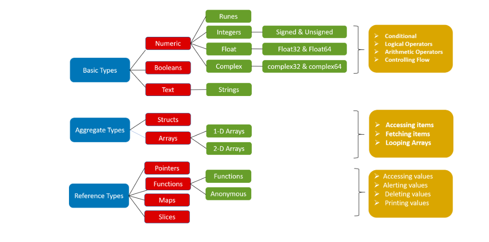

Introduction to GO

	Creation of GO : From 2009 to 2012, a new programming language was being developed by Google Engineers [Robert Griesemer, Rob Pike, and Ken Thompson] called as "go" or "golang"
	Agenda of GO: the agenda of go creation was to build in right, concise and limited features which served as the key reason for GO. They focussed on exploiting basic features and serve clarity rather than complex features which causes ambiguity
	Features of GO : In-Built concurrency, Garbage collection, OOPs simplified, Simplicity and efficiency, inference variable types, platform independent
	Application of GO: Go has applications in Web development, machine learning, command line tools and even server handling
	Real-time usage of GO:
		> Uber for microservices
		> Netflix for heavy data processing
		> Adobe for server handling
		> Yt, Apple and Docker also uses golang 
	Project aspects:
		> API/RPC services
		> CLI
		> Frameworks
		> Webservices
		> Automation/scripts
		> Agents/Daemons
		> Data processing
	
We already have bunch of other programming languages, why we need to learn go again instead of them ?

	1. Go is a compiled language which inherits positive traits from interpreted language.
	2. Go's approach for OOPS features in other languages is simplified (structs, interfaces, composition)
	3. Go has built-in constructs for concurrency (Concurrency establishes synchronization between dependent processes, shared data, and deadlocks. )
	
Getting started with GO :
	Installation and setup
		1. Go to go's official site and download
		2. go version --> To check go version
		3. go env GOROOT --> To check GOROOT path in your system
		
	additional data:
		gopls: It is offical Go language server developed by Go team, which is required when working with Go modules in vscode or other IDEs
		go-outline: It is library useful for extracting JSON representation of the declarations in Go source file
		go mod init: This command is used to initialize a new go.mod file in the currently active directory. This roots the new module in the current directory
		go mod tidy: This command ensures that go.mod file is up-to-date with all the packages and dependencies required by the source code to complete a successful build
		

First program in Go :
	```go
	package main
	import "fmt"
	func main(){
	fmt.Println("Hello, world")
	}
	```
	understanding written code:
	> packages are declared using package keyword followed by package name.
		`package <package name>`
	  package is a go keyword used for declaring packages. Every Go program commences with package declaration. Go organizes its code and reuses it by using packages.
	  In Go, main is a special package that contains the main() function and is also responsible for importing other standard library packages or third-party packages required in the program.
	  
	> import statements in Go are used to include different packages to be used in our program just like other programming languages. the "fmt" (shorthand for format) package is used for formatting input and outputs
		How to import ? There are two ways:
		1. By using import block() which will omit the redundancy of using import keyword for every package
		2. Traditional way as shown above
	> func main():
		Functions are just like in other programming languages are building blocks of code which provides reusability and increases maintainability of code
		
		In Go, main function inside the main package is the entry point. There may be some user-defined functions that might execute before main function but in general main function is the entry point when execution commences. Without main(() function in the main package, the Go compiler will not understand which program to execute.
		
	> fmt.Println() is the inbuilt function in go, bundled in fmt package. This function tells the compiler to print text on the screen.
		if we want to print formatted strings we can use another function inside fmt package that is fmt.Printf(). It contains symbols in the string which you want to print and then arguments after it will replace those values.
		
   How to run the Go program : go run <file name> 
   
 Till now we understand how to write basic hello world program and now let us proceed and understand how we can reuse our data by storing them into variables and reducing code redundancy.
 
 
variables in Go :
	- variables are memory locations used to store data. This data can be manipulated and rendered with use of identifiers. Identifiers are names given to these variables by the programmer.
	Variable Declaration:
		- variables declaration is broadly classified into two types. They are	1. function level 2. pacakge level
		
		```go
		// function level 
		
		var flag int = 24
		var count int
		var msg="Hello world"
		initializer:=100.0
		i, j, k := 1,2,3
		```
		
		```go
		// package level
		var flag int = 2300
		var count int
		var initializer = 26
		var (xy int = 25
		yz string = "var block"
		)
		```
	1. Declaring variables at function level :
	 There are 5 ways in which variables can be declared at functional level.
	 
	 ```go
	 func main(){
	 /*
	 1. Initializing at the time of declaration(standard way)
	 2. Initializing later
	 3. Initializing and declaring with type inference 
	 4. Shorthand initializing and Declaration
	 5. Using blank identifier 
	 */
	 var customerId int = 26 //1. at declaration time
	 var validity int
	 validity = 21 // 2. initializing later(useful while using loops)
	 var LoginMessage = "Hi user" //3. Initializing and Declaration with type inference
	 price := 100.0 // 4. Shorthand initialisation and Declaration 
	 i, j, k := 1, 2, 3 // 5. Initializing and declaration of multiple variables 
	 _=24 //5. Blank identifier
	 fmt.Println(validity, price, LoginMessage)
	 fmt.Println(i,j,k)
	 }
	 ```
	 var keyword is used to create variables in Go.
	 
	 shorthand declaration is useful when you are making extra initialization or creating a variable to catch value returned by a function
	 Since, Go is readable and concise programmming language. Go the programmer is not allowed to declare a variable and keep it unused. A compilation error will occur. To surpass that compilation error, we can use blank identifier that is _ to throwaway the variable and ignore showcasing errors for this variable.
	
	2. Declaring Variables at Package level 
		There are 4 ways in which variables can be declared at package level 
		
		```go
		/*
		1. standard way
		2. Initializing later
		3. type inference 
		4. var block
		*/
		var customerLoginId int = 245 // standard way
		var validity int // initializing later
		var years = 25 // type inference 
		func main() {
		fmt.Println(customerLoginId, validity, years)
		}
		```
		```go 
		var ( // var block
		customerName = "charan"
		customerAge = 45
		customerContact = "7979"
		)
		func main() {
		fmt.Println(customerName, customerAge)
		fmt.Println(customerContact)
		}
		
		```
		
		Note : variable declaration can be used at functional level too.
				variable declaration block is useful to club the variables associated with same function or business logic
				shorthand operator (:) cannot be used inside var block. Go will throw compilation error.
				
		```go
		func main(){
		var(
		planValidity int =24
		counter int 
		totalcontacts = 100
		)
		fmt.Println(planValidity)
		counter = 21
		i,j,k := 1,2,3
		fmt.Println(counter, totalContacts)
		fmt.Println(i,j,k)
		}
		```
		Redeclaration and shadowing:
		- In Go, we cannot redeclare variables in same scope. it means whether it is package level or function level you cannot declare any variable twice. It will throw and error "<variable-name> redeclared in this block"
		- variables in Go can be redeclared and reinitialized in different scope
		- when we reinitialize a variable in different scope, the innermost initialization takes highest priority. This concept is known as "shadowing"
		
		```go
		var customerLoginId string = "c1001"
		// variable declared at package level
		var validity int = 199
		func main() {
		fmt.Println(customerLoginId) // customerLoginId = c1001 
		var customerLoginId string = "c1002"
		// variable redeclared at block level
		validity = 100
		// reinitializing will shadow away previous value 
		fmt.Println(customerLoginId)
		var customerLoginId = 200
		// compilation error : customerLoginId redeclared in this block
		parse()
		fmt.Println(customerLoginId)
		}
		func parse() {
		customerLoginId = "c202"
		fmt.Println(customerLoginId)
		}
		
		```
		
		Variable Naming Conventions:
		
		- Name of variables in Go should commense with a letter, followed by arbitary number of letters, numeric values 
		- A variable should not commence with a numeric value 
		- A variable cannot contain spaces
		- variable names are case sensitive
		- variable names like i,j,k should be used for index type values 
		- variable names like aa, bb, tt should be used to name collections, arrays and slices
		- Interfaces should have a suffix of er in their names
		- variables name should be short but descriptive
		
		Visibility & scope :
		--------------------
		> Visibility and Scope of a variable in Go language can be classified into 3 levels:
		
		```go
		/*
		1.package level
		2. Global level
		3. Block level 
		*/
		package main
		import "fmt"
		var CustomerName string = "charan"
		// Global level --> Accessible by any package and function directly 
		var customerContact string  = "784729"
		//package level --> Accessible by all functions in this package directly 
		func main(){
		var customerLastName string = "Tait"
		// block level --> Accessible inside this function block only
		customerFullName := CustomerName+customerLastName
		fmt.Printf("%v \nContact No. %v)
		}
		```
		
		1. Package level:
		> Variables name, if begins with a lower-case letter then it is scoped to the package level 
		> all the functions within the same package can directly access these variables
		> No Function defined outside this package will be able to directly access these variables
		> These kinds of variables are known s unexported variables
		
		2. Global Variables :
		> variables name, if begins with an upper-cased letter then it is scopped to the global level 
		> All the functions and packages can access these variables 
		> these kinds of variables are known as exported variables 
		
		3. Block Level:
		> variables declared inside a function remains local to function 
		
		what if we required to store some values which cannot be altered? let's drive into Constants to understand 
		
Constants :

	- A constant is a name/identifier used to create fixed values. These values can be neither be altered by any function nor can be shadowed away by any reinitialization
	
	In Go, constants can be created using two approaches: 1. Using const keyword and 2. Constants declaration block 
	
	```go
	
	package main 
	import "fmt"
	const PI float64 = 3.1415926 // approach 1
	const PHI = 1.618035
	
	const ( //approach 2
	EULER's NUMBER = 2.718281
	AVAILABILITY = true 
	)
	func main(){
	fmt.Println("value of PI: ", PI)
	fmt.Println("value of Euler's Number (e): ", EULERS_NUMBER)
	}
	```
	
	1. Using const keyword: 
		> constants can be declared using const keyword, followed by the type of value to be stored
		> you can also follow type inference method as shown above (const PHI = 1.618033 ) to create constants without explicitly specifying the type 
		> Unlike variables you must initialize the value at the time of declaration
		
	2. Constants Declaration Block:
		> For greater code readability and quality Go provides us with an alternative approach of using multiple constants declaration block. You can omit using const keyword as prefix for every constant declaration 
		> const bocks are like var blocks
		
	Enumerated Constants:
	> Enumerated constants are set of named constants
	> an Enum Type is required to be declared using type keyword and the data type of the value stored in the constants of that enum type 
	> Go Uses a predefined declaration called iota to create related constants. IOTA initializes successive untyped integer constants
	> The default value of iota is zero
	
   ```go
   
   package main 
   import "fmt"
   type Directory int // enum Directory
   const (
   
   Contact1 Directory = iota // contact1 = 0
   Contact2 // Contact2 = 1
   Contact3 // Contact3 = 2
   Contact4 // Contact4 = 3
   )
   func main() {
   var NewContact Directory // Declaring a variable NewContact with type Directory
   NewContact = 2
   fmt.Println(NewContact == Contact3 )
   }
   ```
   - To throw away default value and start indexing your constants with index value =1 we can use below underscore approach :
   ```go
   package main 
   import "fmt"
   type Directory int // enum Directory
   const (
   _ Directory = iota // throws away first iota value i.e; 0
   Contact1
   Contact2
   Contact3
   Contact4
   )
   func main(){
   var NewContact Directory // Declaring a variable NewContact with type Directory 
   NewContact = 2
   fmt.Println(NewContact==Contact2)
   }
   ```
 Best Practices :
 1. use small names for unexported variables
 2. use long and appropriate names for exported variables 
 3. use capital letters for acronyms in order to increase their readability
 4. Never leave any variable unused as compilation error will be thrown by Go 
 5. Constants follow the same naming conventions as of variables
 6. Constants names must be written in Uppercase letters for ease of differentiation and readability
 
 
Data Types:



	The size and type of data stored in a variable is defined by its DataTypes (also known as primitives)
	
	DataTypes are broadly classified into 3 types. They are 1. Basic Types (numeric, booleans, text) 2. Aggregate types(structs, Arrays) and 3. Reference Types (pointers, functions, Maps, slices)
	
	Boolean Data Type:
		> Boolean data type has two states: TRUE or FALSE. These two values represent the two truth values of logical and boolean algebra. 
		> Default value for Boolean datatype is FALSE
		> In Go, bool is the keyword to declare a Boolean type variable 
		> Boolean values don't support implicit or explicit type conversion
		
		How Boolean type of variables are creatd in Go ?
			
		```GO
		package main
		import "fmt"
		func main() {
		isPasswordValid := true // the default value of isPasswordValid is false 
		var isAccountValid bool 
		fmt.Println("isPasswordValid:", isPasswordValid, "isAccountValid:", isAccountValid)
		```
 
 
 